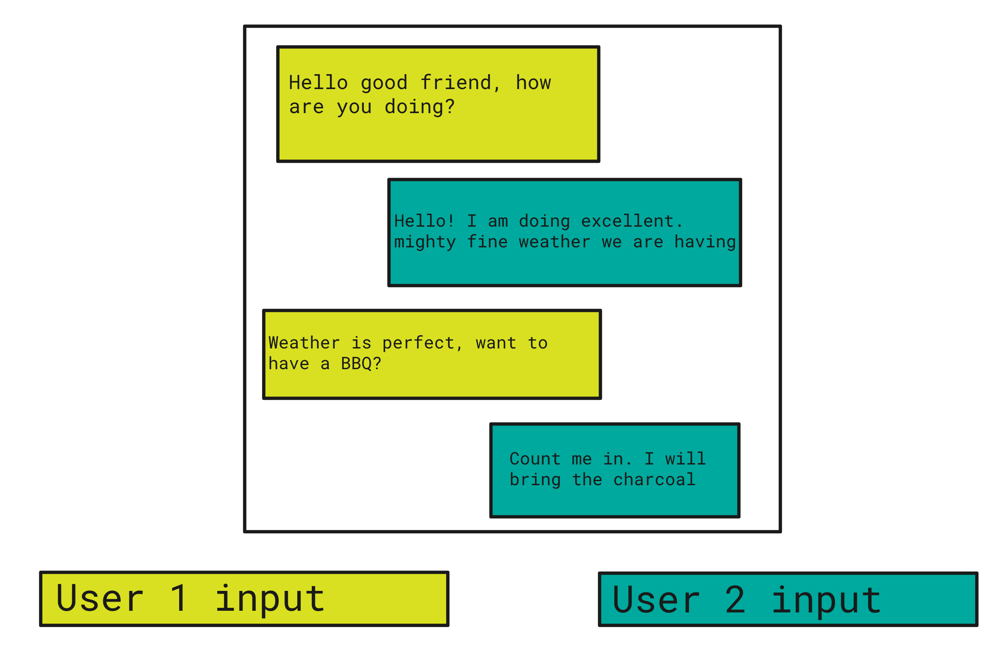

## React Context Assignment

Using context and hooks, create a basic messenger application. For simplicity we will create the entire application on a single page, and it will consist of two user inputs and a chatbox that displays the messages.

 

## Deliverable

1. Create a simple messenger application that has two inputs (user 1 and user 2) and a chat window that shows all chat history.
2. You can only pass state from component to component with context!
3. Style it however you want :) 

### Bonus
1. Display when a user is typing (e.g. user 1 is typing, show user 2 that they are typing)
2. Support deleting a message. For simplicity assume that there is only one chat window.
  
## How to run the project

`npm i && npm start`

 Open [http://localhost:3000](http://localhost:3000)
